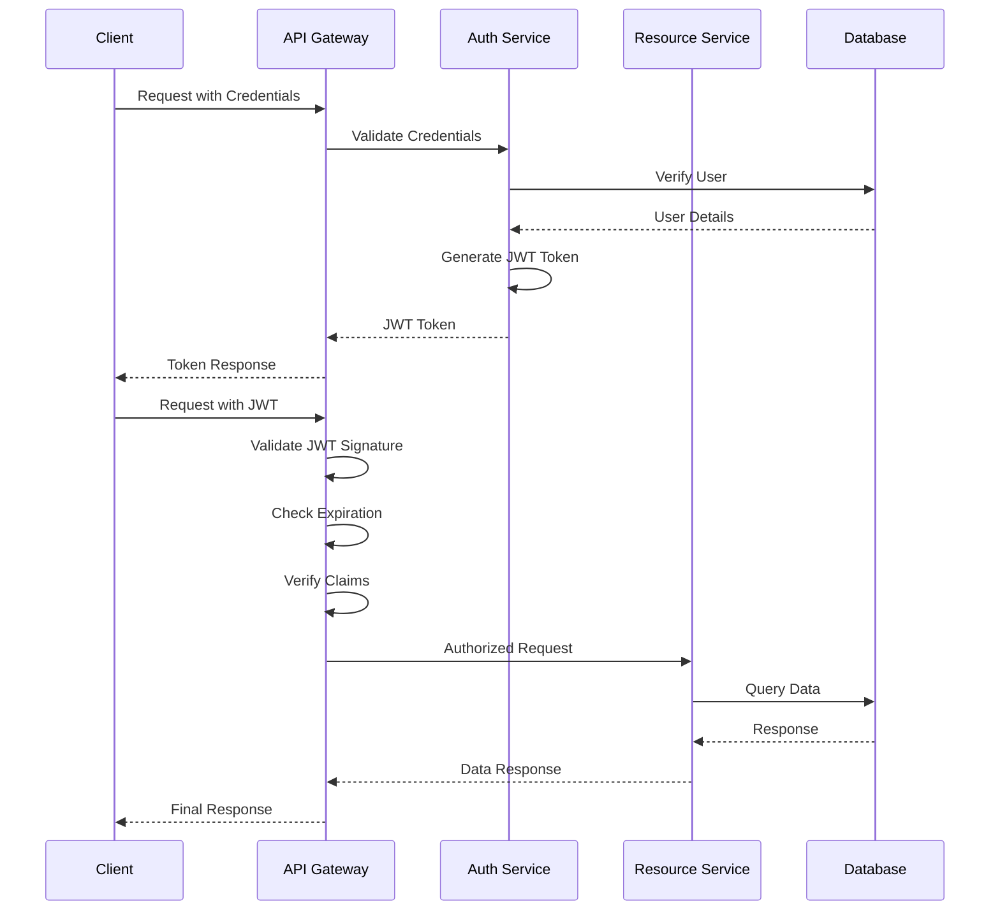
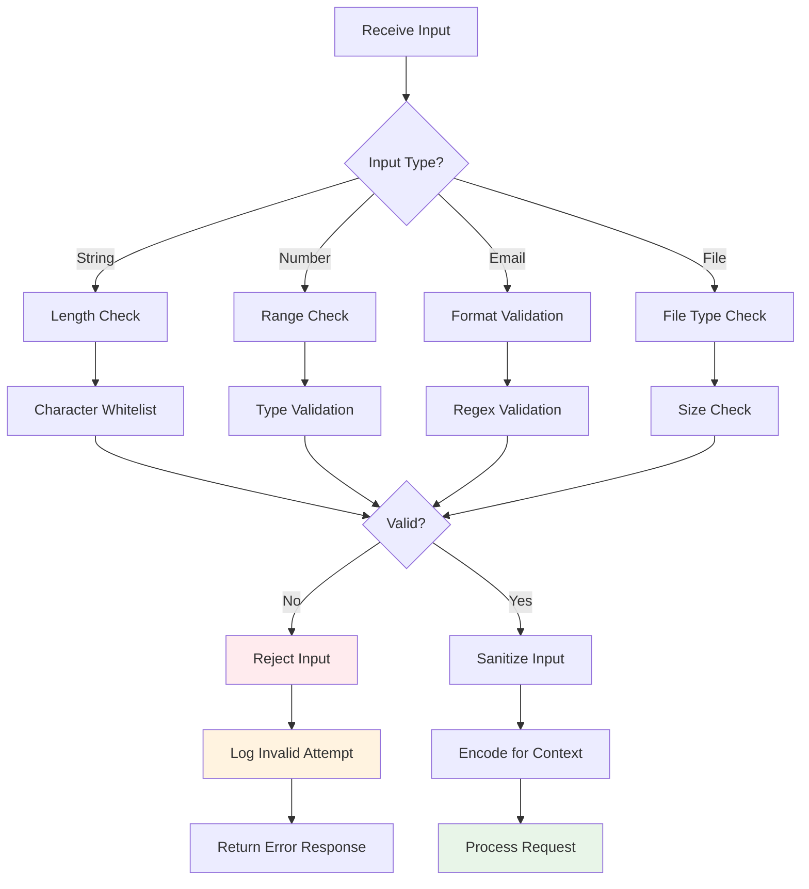
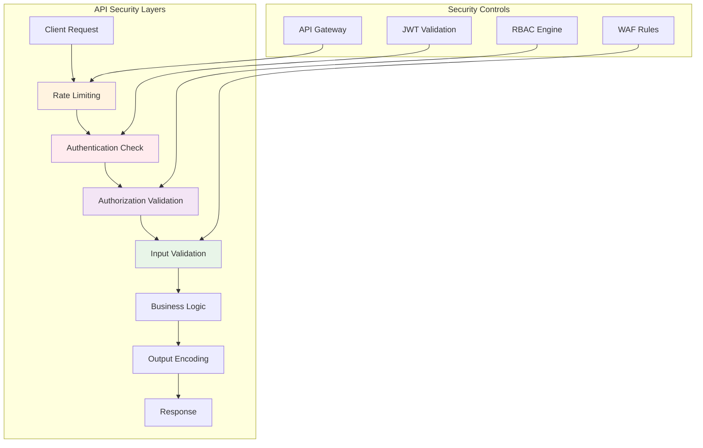
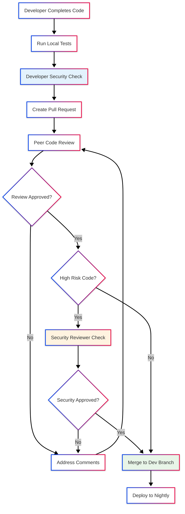

# SECURAA Secure Coding Policy
## Enterprise Secure Development Standards and Guidelines

---

## Document Control

| **Document Title** | Secure Coding Policy |
|-------------------|-----|
| **Document ID** | SECURAA-SCP-001 |
| **Version** | 1.0 |
| **Owner** | Engineering Team|
| **Classification** | Internal Use |

---

## Table of Contents

1. [Executive Summary](#executive-summary)
2. [Purpose and Scope](#purpose-and-scope)
3. [Secure Coding Principles](#secure-coding-principles)
4. [Language-Specific Guidelines](#language-specific-guidelines)
5. [Authentication and Authorization](#authentication-and-authorization)
6. [Data Protection and Encryption](#data-protection-and-encryption)
7. [Input Validation and Output Encoding](#input-validation-and-output-encoding)
8. [Error Handling and Logging](#error-handling-and-logging)
9. [Database Security](#database-security)
10. [API Security](#api-security)
11. [Third-Party Dependencies](#third-party-dependencies)
12. [Code Review Requirements](#code-review-requirements)
13. [Security Testing](#security-testing)
14. [Compliance and Enforcement](#compliance-and-enforcement)
15. [Secure Coding for User Interface](#secure-coding-for-user-interface)

---

## Executive Summary

This Secure Coding Policy establishes mandatory security standards and best practices for all software development activities within SECURAA. The policy ensures that security is integrated throughout the software development lifecycle, reducing vulnerabilities and protecting sensitive data.

### Policy Objectives

- **Prevent Security Vulnerabilities**: Proactively address common security flaws during development
- **Protect Sensitive Data**: Ensure proper handling of customer and business-critical information
- **Ensure Compliance**: Meet regulatory requirements and industry standards
- **Standardize Practices**: Provide consistent security guidelines across all development teams
- **Enable Security Automation**: Support integration of security tools in CI/CD pipelines

---

## Purpose and Scope

### Purpose

This policy provides comprehensive secure coding guidelines for SECURAA development teams to:
- Minimize security vulnerabilities in application code
- Establish consistent security practices across all projects
- Facilitate security code reviews and assessments
- Support automated security and validation

### Scope

**Applicable To:**
- All software development activities for SECURAA platform
- All programming languages and frameworks in use
- All developers, contractors, and third-party development partners
- All code repositories and development environments

**Covered Technologies:**
- **Backend**: Golang, Python
- **Frontend**: JavaScript, React, Node.js
- **Databases**: MongoDB, Redis, PostgreSQL
- **Infrastructure**: Docker, AWS
- **Build Tools**: Make, Shell scripts, AWS CodeBuild

---
## Secure Coding Principles
### OWASP Top 10 Protection

| OWASP Risk | Protection Measures | Implementation Status |
|------------|-------------------|----------------------|
| **A01: Broken Access Control** | JWT validation, authorization checks | ✅ Implemented |
| **A02: Cryptographic Failures** | AES-256 encryption, TLS 1.2+, secure key management | ✅ Implemented |
| **A03: Injection** | Parameterized queries, input validation, ORM usage | ✅ Implemented |
| **A04: Insecure Design** | Threat modeling, security requirements, design reviews | 🟡 In Progress |
| **A05: Security Misconfiguration** | Hardened configs, automated scanning, secure defaults | ✅ Implemented |
| **A06: Vulnerable Components** | Dependency scanning, version management, patching | 🟡 In Progress |
| **A07: Authentication Failures** | MFA, secure session management, password policies | ✅ Implemented |
| **A08: Software/Data Integrity** | Code signing, integrity checks, secure pipelines | 🟡 In Progress |
| **A09: Logging Failures** | Comprehensive logging, secure log storage, monitoring | ✅ Implemented |
| **A10: SSRF** | URL validation, network segmentation, allowlisting | ✅ Implemented |

---

## Language-Specific Guidelines

### Go (Golang) Secure Coding Standards

#### 1. Error Handling

**❌ INSECURE PRACTICE:**
```go
result, _ := someFunction()  // Ignoring errors
```

**✅ SECURE PRACTICE:**
```go
result, err := someFunction()
if err != nil {
    logger.Error("Failed to execute function", err.Error())
    return fmt.Errorf("operation failed: %w", err)
}
```

#### 2. SQL Injection Prevention

**❌ INSECURE PRACTICE:**
```go
query := "SELECT * FROM users WHERE username = '" + username + "'"
db.Query(query)
```

**✅ SECURE PRACTICE:**
```go
query := "SELECT * FROM users WHERE username = $1"
db.Query(query, username)
```

#### 3. Cryptographic Operations

**❌ INSECURE PRACTICE:**
```go
import "crypto/md5"  // Weak hash algorithm
hash := md5.Sum([]byte(password))
```

**✅ SECURE PRACTICE:**
```go
import "golang.org/x/crypto/bcrypt"
hashedPassword, err := bcrypt.GenerateFromPassword([]byte(password), bcrypt.DefaultCost)
if err != nil {
    return err
}
```

#### 4. MongoDB Query Security

**Current Implementation (securaa_lib):**
```go
// Secure MongoDB connection with authentication
mongoDBDialInfo := &mgo.DialInfo{
    Addrs:    []string{config["mongoDbHost"]},
    Timeout:  60 * time.Second,
    Database: config["mongoAuthDb"],
    Username: config["mongoUserName"],
    Password: config["mongoPassword"],
}
```

**Security Requirements:**
- Always use authenticated connections
- Implement connection timeouts
- Use encrypted credentials (never hardcode)
- Validate all query parameters
- Use MongoDB's built-in parameterization

#### 5. JWT Token Handling

**Current Implementation (securaa):**
```go
import "github.com/dgrijalva/jwt-go"

// Token generation must include:
// - Expiration time
// - Issuer validation
// - Strong signing key
// - Claim validation
```

**Security Requirements:**
- Use strong signing algorithms (e.g., RS256, HS256)
- Implement token expiration (1 hour recommended)
- Validate all claims on receipt
- Implement token revocation mechanism

#### 6. Goroutine and Concurrency Safety

**✅ SECURE PRACTICE:**
```go
var mu sync.Mutex
var safeMap = make(map[string]string)

func updateMap(key, value string) {
    mu.Lock()
    defer mu.Unlock()
    safeMap[key] = value
}
```

**Requirements:**
- Use mutexes for shared data access
- Implement proper defer statements for cleanup
- Handle panic recovery in goroutines

**Note:** For comprehensive JavaScript/React secure coding guidelines, refer to [Section 15: Secure Coding for User Interface](#secure-coding-for-user-interface).

### Shell Script Security (Build Scripts)

#### 1. Input Validation

**❌ INSECURE PRACTICE:**
```bash
eval $USER_INPUT  # Command injection vulnerability
```

**✅ SECURE PRACTICE:**
```bash
# Validate input before use
if [[ ! "$USER_INPUT" =~ ^[a-zA-Z0-9_-]+$ ]]; then
    echo "Invalid input"
    exit 1
fi
```

#### 2. Secure File Operations

**From build_securaa scripts:**
```bash
# Use absolute paths
BUILD_LOG="/var/log/securaa/build.log"

# Check file existence before operations
if [ ! -f "$CONFIG_FILE" ]; then
    log_and_exit "Configuration file not found"
fi

# Set appropriate permissions
chmod 600 "$SENSITIVE_FILE"
chown root:root "$SENSITIVE_FILE"
```

#### 3. Credential Management

**✅ SECURE PRACTICE:**
```bash
# Never hardcode credentials
# Use environment variables or secure vaults
MONGO_PASSWORD="${MONGO_PASSWORD:-$(aws secretsmanager get-secret-value --secret-id mongo-pwd)}"

# Avoid logging sensitive information
set +x  # Disable command echoing for sensitive operations
mysql -u "$DB_USER" -p"$DB_PASS" < script.sql
set -x  # Re-enable command echoing
```

---

## Authentication and Authorization

### JWT Implementation Standards



### Authentication Requirements

**Mandatory Controls:**

1. **Password Security**
   - Minimum 12 characters length
   - Complexity requirements: uppercase, lowercase, numbers, special characters
   - Use password hashing for storage
   - Implement password history (prevent reuse of last 10 passwords)
   - Account lockout after 5 failed attempts

2. **Multi-Factor Authentication (MFA)**
   - Implement MFA for administrative access
   - Support TOTP (Time-based One-Time Password)
   - Provide backup codes for account recovery
   - Enforce MFA for sensitive operations

3. **Token Management**
   - JWT token expiration: 1 hour for access tokens
   - Include issuer (iss), audience (aud), expiration (exp) claims
   - Implement token revocation mechanism

## Data Protection and Encryption

### Encryption Standards

#### Data at Rest

**Requirements:**
- **Algorithm**: AES-256 encryption
- **Scope**: All sensitive data

**Implementation (Current - securaa_lib):**
```go
package encrypt_decrypt

import (
    "crypto/aes"
    "crypto/cipher"
    "encoding/base64"
)

func CredentialsEncrypt(stringToEncrypt string, key string) (string, error) {
    origData := []byte(stringToEncrypt)
    k := []byte(key)
    
    // AES encryption
    block, err := aes.NewCipher(k)
    if err != nil {
        return "", err
    }
    
    blockSize := block.BlockSize()
    origData = PKCS7Padding(origData, blockSize)
    blockMode := cipher.NewCBCEncrypter(block, k[:blockSize])
    crypted := make([]byte, len(origData))
    blockMode.CryptBlocks(crypted, origData)
    
    return base64.StdEncoding.EncodeToString(crypted), nil
}
```

**Security Requirements:**
- Use 256-bit keys minimum
- Implement proper padding (PKCS7)
- Use CBC or GCM mode for block ciphers
- Never reuse initialization vectors (IVs)
- Securely delete decrypted data after use

#### Data in Transit

**Requirements:**
- **Protocol**: TLS 1.2 or higher (TLS 1.3 preferred)
- **Certificate Management**: Valid certificates from trusted CAs
- **Certificate Rotation**: Annual rotation minimum

**Configuration Example:**
```go
// TLS configuration for HTTPS servers
tlsConfig := &tls.Config{
    MinVersion: tls.VersionTLS12, // Minimum supported TLS version
    MaxVersion: tls.VersionTLS13, // Maximum supported TLS version
    PreferServerCipherSuites: true, // Prefer server's cipher suites over client's preferences
    CipherSuites: []uint16{
        tls.TLS_AES_128_GCM_SHA256,
        tls.TLS_AES_256_GCM_SHA384,
        tls.TLS_ECDHE_RSA_WITH_AES_128_GCM_SHA256,
        tls.TLS_CHACHA20_POLY1305_SHA256,
        
        // ECDHE-RSA key exchange
        tls.TLS_ECDHE_RSA_WITH_AES_128_GCM_SHA256,
        tls.TLS_ECDHE_RSA_WITH_AES_256_GCM_SHA384,
        tls.TLS_ECDHE_RSA_WITH_CHACHA20_POLY1305_SHA256,
        // Avoid weak or deprecated cipher suites
        tls.TLS_FALLBACK_SCSV, // Prevents protocol downgrade attacks
    },
}

server := &http.Server{
    Addr:      ":443",
    TLSConfig: tlsConfig,
}
```

### Sensitive Data Handling

**Data Classification:**

| Classification | Examples                               | Encryption Required | Access Controls |
|----------------|----------------------------------------|-------------------|-----------------|
| **Critical/High**  | Application Credentials                | Yes - AES-256 | Named individuals only |
| **Medium**     | Business data, internal communications | Yes - TLS in transit | Authenticated users |
| **Low**        | Public information, marketing content  | TLS in transit | Public access allowed |

**Handling Requirements:**
- Never log sensitive data (passwords, tokens, PII)
- Mask sensitive data in logs (show only last 4 digits)
- Use secure memory for sensitive operations
- Implement data retention policies

---

## Input Validation and Output Encoding

### Input Validation Framework



### Validation Rules

#### String Input Validation

**✅ SECURE PRACTICE:**
```go
import (
    "regexp"
    "strings"
)

func ValidateUsername(username string) error {
    // Length validation
    if len(username) < 3 || len(username) > 50 {
        return errors.New("username must be between 3 and 50 characters")
    }
    
    // Character whitelist
    validUsername := regexp.MustCompile(`^[a-zA-Z0-9_-]+$`)
    if !validUsername.MatchString(username) {
        return errors.New("username contains invalid characters")
    }
    
    // Prevent SQL injection patterns
    sqlPatterns := []string{"'", "\"", ";", "--", "/*", "*/", "xp_", "sp_"}
    for _, pattern := range sqlPatterns {
        if strings.Contains(strings.ToLower(username), pattern) {
            return errors.New("username contains prohibited patterns")
        }
    }
    
    return nil
}
```

#### Email Validation

```go
func ValidateEmail(email string) error {
    emailRegex := regexp.MustCompile(`^[a-zA-Z0-9._%+\-]+@[a-zA-Z0-9.\-]+\.[a-zA-Z]{2,}$`)
    if !emailRegex.MatchString(email) {
        return errors.New("invalid email format")
    }
    return nil
}
```

#### URL Validation

```go
import "net/url"

func ValidateURL(rawURL string) error {
    parsedURL, err := url.Parse(rawURL)
    if err != nil {
        return errors.New("invalid URL format")
    }
    
    // Whitelist allowed schemes
    allowedSchemes := map[string]bool{
        "http":  true,
        "https": true,
    }
    
    if !allowedSchemes[parsedURL.Scheme] {
        return errors.New("unsupported URL scheme")
    }
    
    // Prevent SSRF - block internal IP ranges
    host := parsedURL.Hostname()
    if isInternalIP(host) {
        return errors.New("access to internal resources not allowed")
    }
    
    return nil
}
```

### Output Encoding


#### JSON Context

```go
import "encoding/json"

func SerializeJSON(data interface{}) ([]byte, error) {
    // Use json.Marshal for automatic escaping
    jsonData, err := json.Marshal(data)
    if err != nil {
        return nil, err
    }
    return jsonData, nil
}
```

#### SQL Context

```go
// Always use parameterized queries
query := "SELECT * FROM users WHERE email = $1 AND active = $2"
rows, err := db.Query(query, email, true)
```

---

## Error Handling and Logging

### Secure Error Handling

**❌ INSECURE PRACTICE:**
```go
func HandleLogin(w http.ResponseWriter, r *http.Request) {
    user, err := db.GetUser(username)
    if err != nil {
        http.Error(w, err.Error(), 500)  // Exposes internal details
    }
}
```

**✅ SECURE PRACTICE:**
```go
func HandleLogin(w http.ResponseWriter, r *http.Request) {
    user, err := db.GetUser(username)
    if err != nil {
        // Log detailed error internally
        logger.Error("Database error during login", 
            "error", err.Error(),
            "username", username)
        
        // Return generic error to client
        http.Error(w, "An error occurred. Please try again later.", 500)
        return
    }
}
```

### Logging Standards

#### What to Log

**Security Events:**
- Authentication attempts (success and failure)
- Authorization failures
- Input validation failures
- Sensitive data access
- Configuration changes
- Admin actions

**Example Implementation:**
```go
import "go.uber.org/zap"

var logger *zap.Logger

func InitLogger() {
    logger, _ = zap.NewProduction()
    defer logger.Sync()
}

// Security event logging
func LogSecurityEvent(eventType, username, ip, details string) {
    logger.Info("Security Event",
        zap.String("event_type", eventType),
        zap.String("username", username),
        zap.String("ip_address", ip),
        zap.String("details", details),
        zap.Time("timestamp", time.Now()),
    )
}
```

#### What NOT to Log

**Prohibited Data:**
- Passwords or password hashes
- Session tokens or JWT tokens
- API keys or secrets
- Credit card numbers or CVV codes
- Social Security Numbers
- Private encryption keys

**Sanitization Example:**
```go
func SanitizeForLogging(data string, fieldType string) string {
    switch fieldType {
    case "creditCard":
        if len(data) > 4 {
            return "****" + data[len(data)-4:]
        }
    case "email":
        parts := strings.Split(data, "@")
        if len(parts) == 2 && len(parts[0]) > 2 {
            return parts[0][:2] + "***@" + parts[1]
        }
    case "token":
        return "[REDACTED]"
    }
    return data
}
```

### Log Security

**Requirements:**
- Store logs in a centralized location
- Implement log rotation and retention policies
- Implement access controls on log files
- Monitor logs for security events
- Implement log integrity verification

---

## Database Security

### MongoDB Security (Primary Database)

#### Connection Security

**Current Implementation:**
```go
// From zona_batch/config/batch.conf and securaa_lib
mongoDBDialInfo := &mgo.DialInfo{
    Addrs:    []string{config["mongoDbHost"]},
    Timeout:  60 * time.Second,
    Database: config["mongoAuthDb"],
    Username: config["mongoUserName"],
    Password: config["mongoPassword"],
}
```

**Security Requirements:**
1. **Authentication**
   - Always enable MongoDB authentication
   - Use strong passwords (16+ characters)
   - Implement role-based access control
   - Use SCRAM-SHA-256 authentication mechanism

2. **Connection String Security**
   - Never hardcode credentials
   - Implement connection pooling with limits

3. **Query Security**
   ```go
   // ❌ INSECURE - String concatenation
   query := bson.M{"username": username}  // If username is from user input
   
   // ✅ SECURE - Proper parameterization
   query := bson.M{"username": bson.M{"$eq": username}}
   
   // ✅ SECURE - Input validation before query
   if err := ValidateUsername(username); err != nil {
       return err
   }
   ```

#### MongoDB Security Checklist

- ✅ Enable authentication (`security.authorization: enabled`)
- ✅ Use encrypted connections (TLS/SSL)
- ✅ Implement network access restrictions
- ✅ Regular updates and patching
- ✅ Least privilege user accounts

### PostgreSQL Security

**Connection Security:**
```go
import "github.com/lib/pq"

// Secure PostgreSQL connection
connStr := fmt.Sprintf(
    "host=%s port=%s user=%s password=%s dbname=%s sslmode=require",
    host, port, user, password, dbname,
)

db, err := sql.Open("postgres", connStr)
if err != nil {
    return err
}

// Set connection pool limits
db.SetMaxOpenConns(25)
db.SetMaxIdleConns(5)
db.SetConnMaxLifetime(5 * time.Minute)
```

**Query Security:**
```go
// Always use parameterized queries
query := `
    SELECT id, username, email 
    FROM users 
    WHERE username = $1 AND status = $2
`
rows, err := db.Query(query, username, "active")
```

---

## API Security

### RESTful API Security Standards



### API Security Requirements

#### 1. Authentication

```go
// JWT middleware for API authentication
func AuthenticateJWT(next http.Handler) http.Handler {
    return http.HandlerFunc(func(w http.ResponseWriter, r *http.Request) {
        authHeader := r.Header.Get("Authorization")
        if authHeader == "" {
            http.Error(w, "Missing authorization header", http.StatusUnauthorized)
            return
        }
        
        tokenString := strings.TrimPrefix(authHeader, "Bearer ")
        token, err := jwt.Parse(tokenString, func(token *jwt.Token) (interface{}, error) {
            // Validate signing method
            if _, ok := token.Method.(*jwt.SigningMethodHMAC); !ok {
                return nil, fmt.Errorf("unexpected signing method")
            }
            return []byte(jwtSecret), nil
        })
        
        if err != nil || !token.Valid {
            http.Error(w, "Invalid token", http.StatusUnauthorized)
            return
        }
        
        // Add claims to context
        claims := token.Claims.(jwt.MapClaims)
        ctx := context.WithValue(r.Context(), "claims", claims)
        next.ServeHTTP(w, r.WithContext(ctx))
    })
}
```

#### 4. API Security Checklist

- ✅ Implement authentication for all endpoints
- ✅ Use HTTPS for all API communications
- ✅ Validate and sanitize all inputs
- ✅ Use appropriate HTTP status codes
- ✅ Implement proper error handling
- ✅ Version your APIs
- ✅ Implement API logging and monitoring
- ✅ Use security headers (HSTS, CSP, etc.)
- ✅ Implement request/response validation

---

## Third-Party Dependencies

### Dependency Management

#### Go Modules (go.mod)

**Current Dependencies Analysis:**
```
// From securaa/go.mod
- github.com/dgrijalva/jwt-go v3.2.0 (⚠️ Deprecated - Update Required)
- gopkg.in/mgo.v2 (⚠️ Unmaintained - Consider migration)
- go.uber.org/zap v1.21.0 (✅ Active)
- github.com/gorilla/mux v1.8.0 (✅ Active)
```

**Security Requirements:**

1. **Vulnerability Scanning**
   ```bash
   # Run security scan on dependencies
   go list -json -m all | nancy sleuth
   
   # Or use govulncheck
   govulncheck ./...
   ```

2. **Dependency Updates**
   ```bash
   # Check for updates
   go list -u -m all
   
   # Update dependencies
   go get -u ./...
   go mod tidy
   ```

3. **Version Pinning**
   ```go
   // In go.mod, use specific versions
   require (
       github.com/gorilla/mux v1.8.0  // Pinned version
       go.uber.org/zap v1.21.0
   )
   ```

### Third-Party Component Security Checklist

- ✅ Maintain inventory of all dependencies
- ✅ Regular vulnerability scanning (weekly minimum)
- ✅ Automated dependency updates
- ✅ Security advisory monitoring
- ✅ License compliance verification
- ✅ Source code review for critical dependencies
- ✅ Vendor security assessment
- ✅ Dependency isolation and sandboxing

---

## Code Review Requirements

### Mandatory Code Review Process



### Code Review Checklist

#### Security Review Items

**Authentication & Authorization:**
- [ ] Authentication required for all sensitive operations
- [ ] Authorization checks implemented for all resources
- [ ] Session management properly implemented
- [ ] Passwords properly hashed (never stored in plain text)
- [ ] JWT tokens properly validated

**Input Validation:**
- [ ] All user inputs validated and sanitized
- [ ] Whitelist validation used where possible
- [ ] File uploads validated (type, size, content)
- [ ] DB injection prevention (parameterized queries)
- [ ] XSS prevention (output encoding)

**Data Protection:**
- [ ] Sensitive data encrypted at rest
- [ ] TLS/SSL used for data in transit
- [ ] Credentials stored securely (never hardcoded)

**Error Handling:**
- [ ] Errors handled gracefully without exposing internals
- [ ] Sensitive information not logged
- [ ] Generic error messages returned to clients
- [ ] Detailed errors logged for debugging

### High-Risk Code Areas

Require additional seniors team review:
- Authentication and authorization logic
- Cryptographic implementations
- File upload/download functionality
- Database query construction
- API endpoint implementations
- External service integrations

---

### Static Application Security Testing (SAST)

**Tools and Implementation:**
```bash
# GoSec - Go security checker
gosec -fmt=json -out=results.json ./...

# Go vet - Built-in static analysis
go vet ./...

# Staticcheck - Additional static analysis
staticcheck ./...
```

### Dependency Scanning

```bash
# Nancy - Dependency vulnerability scanner
go list -json -m all | nancy sleuth

# Govulncheck - Official Go vulnerability checker
govulncheck ./...
```

### Testing Schedule

| Test Type | Frequency | Automation | Responsibility |
|-----------|-----------|------------|----------------|
| **Unit Tests** | Every commit | No         | Developers |
| **Integration Tests** | Every commit | No          | Developers |
| **SAST** | Daily | Yes        | CI/CD Pipeline |
| **Dependency Scan** | Daily | Yes        | CI/CD Pipeline |

---

## Compliance and Enforcement

### Policy Compliance

**Enforcement Mechanisms:**

1. **Automated Checks**
   - CI/CD pipeline security gates via gosec

2. **Manual Reviews**
   - Peer code reviews (mandatory)
   - Senior engineering team reviews (high-risk code)
   - Architecture security reviews
   - Annual security audits

3. **Training Requirements**
   - Secure coding training (annual)
   - OWASP Top 10 awareness
   - Language-specific security training

### Metrics and Reporting

**Security Metrics from GoSec:**
- Number of security issues by severity
- Time to remediate security issues
- Security test coverage percentage
- Dependency vulnerability count

**Monthly Security Report:**
- Security issues identified and resolved
- Training completion status
- Recommendations for improvement

---

## Secure Coding for User Interface

This section provides comprehensive secure coding guidelines specifically for the Securaa UI platform (React/JavaScript frontend). These guidelines complement the general secure coding principles and provide UI-specific security measures and implementations.

### Authentication & Access Control

#### Strong Password Requirements
The platform enforces robust password policies to ensure account security:

- **Minimum Length:** 8 characters
- **Complexity Requirements:**
  - At least one uppercase letter (A-Z)
  - At least one lowercase letter (a-z)
  - At least one number (0-9)
  - At least one special character (!@#$%^&*)
- **Password Confirmation:** Users must confirm passwords to prevent typing errors
- **Password Validation:** Real-time validation provides immediate feedback on password strength

**Example Implementation:**
The platform uses the following regex pattern for password validation:
```javascript
/^(?=.*[0-9])(?=.*[a-z])(?=.*[A-Z])(?=.*[!@#$%^&*])[a-zA-Z0-9!@#$%^&*]{8,40}$/
```
This pattern is enforced across all password-related components (user registration, password change, password reset) to ensure consistent security standards.

#### Secure Authentication
- **Token-Based Authentication:** All user sessions use secure token-based authentication
- **Encrypted Credentials:** Authentication credentials are encrypted before storage using AES encryption
- **Session Management:** Secure session handling with automatic timeout protection

**Example Implementation:**
Authentication tokens are stored in encrypted cookies using AES encryption. The encryption key is configured via environment variables (see `.env` configuration). All API requests include authentication tokens in headers to ensure secure access to protected resources.

### Data Protection

#### Encryption
- **Data Encryption:** Sensitive data is encrypted using industry-standard AES encryption
- **Secure Storage:** Authentication tokens and sensitive information are stored securely
- **Data in Transit:** All data transmission is protected using HTTPS/TLS encryption

**Configuration Note:** Encryption keys are stored in environment variables (`.env` file) and accessed via `REACT_APP_ENCRYPTION_KEY` and `REACT_APP_API_KEY`. This ensures that sensitive keys are not hardcoded in the source code and can be configured per environment (development, staging, production).

**Example Implementation:**
The platform uses AES encryption in CBC mode with PKCS7 padding and random Initialization Vectors (IV) for enhanced security:

```javascript
// Encryption function using AES with random IV
export function encrypt(data) {
    // Generate a random IV for each encryption
    const iv = CryptoJS.lib.WordArray.random(16);
    
    // Encrypt using AES in CBC mode with PKCS7 padding
    const encrypted = CryptoJS.AES.encrypt(data, key, {
        iv: iv,
        mode: CryptoJS.mode.CBC,
        padding: CryptoJS.pad.Pkcs7,
    });
    
    // Combine IV and ciphertext for secure storage
    const combinedData = iv.concat(encrypted.ciphertext).toString(CryptoJS.enc.Base64);
    return combinedData;
}

// Decryption function
export function decrypt(encryptedData) {
    // Extract IV and ciphertext
    const rawData = CryptoJS.enc.Base64.parse(encryptedData);
    const iv = CryptoJS.lib.WordArray.create(rawData.words.slice(0, 4));
    const ciphertext = CryptoJS.lib.WordArray.create(rawData.words.slice(4));
    
    // Decrypt using the same key and IV
    const decrypted = CryptoJS.AES.decrypt({ ciphertext: ciphertext }, key, {
        iv: iv,
        mode: CryptoJS.mode.CBC,
        padding: CryptoJS.pad.Pkcs7,
    });
    
    return decrypted.toString(CryptoJS.enc.Utf8);
}
```

The encryption key is loaded from environment variables: `const key = CryptoJS.enc.Utf8.parse(process.env.REACT_APP_API_KEY)`

#### Secure Data Handling
- **Encrypted Cookies:** Authentication tokens stored in encrypted cookies
- **Secure Session Storage:** User session data stored securely
- **Automatic Cleanup:** Sensitive data automatically cleared on logout or session expiration

**Example Implementation:**
All cookie values are encrypted before storage to protect sensitive authentication tokens and user data:

```javascript
// Cookie encryption before storage
setCookie: function (cname, cvalue, exdays) {
    if (cname !== "tenantcode") {
        cvalue = typeof cvalue === 'undefined' ? '' : cvalue;
        let data = encrypt(cvalue.toString());  // Encrypt before storing
        document.cookie = cname + "=" + data + ";" + ";path=/";
    }
}

// Cookie decryption when retrieving
getCookie: function (cname) {
    let name = cname + "=";
    let decodedCookie = decodeURIComponent(document.cookie);
    // ... extract cookie value ...
    let data = decrypt(data);  // Decrypt when retrieving
    return data;
}
```

This ensures that even if cookies are intercepted, the data remains protected through AES encryption.

### Input Validation & Sanitization

#### Comprehensive Input Validation
The platform validates all user inputs to prevent security vulnerabilities:

- **Email Validation:** Strict email format validation with support for multiple recipients
- **Text Field Validation:** Alphanumeric validation for names and text fields
- **URL Validation:** Secure URL format validation for web addresses
- **Numeric Validation:** Range and type validation for numeric inputs
- **Query Sanitization:** Search queries are sanitized to prevent injection attacks

**Example Implementation:**
Email validation uses the regex pattern: `/^[a-zA-Z0-9._%+-]+@[a-zA-Z0-9.-]+\.[a-zA-Z]{2,}$/` to ensure proper email format. Text fields for names use `/^[a-zA-Z ]*$/i` to allow only alphabetic characters and spaces, preventing injection of malicious code.

#### Real-Time Validation
- **Immediate Feedback:** Users receive instant validation feedback
- **Clear Error Messages:** User-friendly error messages guide correct input
- **Preventive Measures:** Invalid inputs are blocked before submission

### Secure Communication

#### HTTPS/TLS Encryption
- **Forced HTTPS:** All communications are encrypted using HTTPS
- **TLS/SSL:** Industry-standard encryption protocols protect data in transit
- **Certificate Management:** Secure certificate handling and validation

#### API Security
- **Authenticated Requests:** All API requests require valid authentication tokens
- **Secure Headers:** Proper security headers on all API communications
- **Token Management:** Secure token handling and rotation

**Configuration Note:** API endpoints are configured via environment variables (`.env` file) using `REACT_APP_API_URL`. This allows different API endpoints for different environments without hardcoding URLs in the source code.

### Code Execution Security

#### Custom Code Validation
For platforms that allow custom code execution (e.g., Python scripts):

- **Dangerous Command Blocking:** System-level commands are blocked to prevent unauthorized access
- **Code Validation:** All custom code is validated before execution
- **Template Protection:** Critical code templates are protected from deletion
- **Sandboxed Execution:** Code execution is restricted to prevent system access

**Example Implementation:**
The platform scans custom Python code for dangerous patterns before execution. Commands like `os.` and `subprocess.` are blocked to prevent system-level access. The validation process checks each line of code and prevents execution if dangerous patterns are detected, notifying users with clear error messages.

#### Security Controls
- **Pre-Execution Validation:** Code is scanned for dangerous patterns before running
- **Error Prevention:** Users are notified when potentially dangerous code is detected
- **Template Integrity:** Default code templates cannot be removed, ensuring security baseline

### Session Management

#### Secure Session Handling
- **Session Timeout:** Automatic session expiration after inactivity (configurable timeout duration)
- **Session Extension:** Secure session extension mechanism with user notification
- **Token Refresh:** Automatic token refresh to maintain secure sessions
- **Secure Logout:** Complete session cleanup on logout

**Example Implementation:**
The platform implements session timeout monitoring that checks session expiration time and warns users when their session is about to expire (typically 5 minutes before expiration). Users can extend their session securely, and all session data is automatically cleared when the session expires or the user logs out.

**Configuration Note:** Session timeout duration is configurable through system settings and can be managed per deployment. Default session timeout values can be configured via environment variables if needed.

#### Session Protection
- **Automatic Cleanup:** All session data cleared on timeout or logout
- **Token Expiration:** Secure handling of expired authentication tokens
- **Multi-Session Support:** Secure handling of multiple concurrent sessions

### Security Headers & Browser Protection

#### HTTP Security Headers
The platform implements multiple security headers to protect against common web vulnerabilities:

- **Strict Transport Security (HSTS):** Forces secure HTTPS connections with `max-age=31536000; includeSubDomains`
- **Content Security Policy (CSP):** Restricts resource loading to prevent XSS attacks
- **Frame Protection:** Prevents clickjacking attacks via `X-Frame-Options: SAMEORIGIN`
- **Content Type Protection:** Prevents MIME type sniffing attacks via `X-Content-Type-Options: nosniff`
- **Referrer Policy:** Controls information sharing in HTTP referrers with `strict-origin-when-cross-origin`
- **Permissions Policy:** Restricts access to browser features (camera, microphone, geolocation)

**Example Implementation:**
These security headers are configured in the web server configuration (Nginx) to ensure all HTTP responses include the necessary security headers. The HSTS header forces browsers to use HTTPS for all future connections to the domain for one year.

#### Browser Security
- **XSS Protection:** Multiple layers of protection against cross-site scripting
- **Clickjacking Prevention:** Protection against UI redressing attacks
- **MIME Sniffing Prevention:** Prevents content type confusion attacks

### Compliance & Best Practices

#### Security Standards
The platform follows industry best practices and security standards:

- **OWASP Guidelines:** Adherence to OWASP security recommendations, including OWASP Top 10 security risks
- **Secure Coding Practices:** Implementation of secure coding standards with input validation, output encoding, and secure authentication
- **Regular Security Reviews:** Ongoing security assessment and improvement

**Example Implementation:**
Following OWASP guidelines, the platform implements defense-in-depth strategies including:
- Input validation at multiple layers (client-side and server-side)
- Secure password storage and transmission
- Protection against common vulnerabilities like SQL injection, XSS, and CSRF
- Secure session management with proper timeout and cleanup mechanisms

#### Data Protection
- **Privacy Protection:** User data is handled according to privacy best practices
- **Secure Storage:** Sensitive data stored using encryption
- **Access Control:** Role-based access control for different user types

#### Monitoring & Maintenance
- **Error Handling:** Secure error handling that doesn't expose sensitive information
- **Logging:** Security event logging for audit and monitoring
- **Regular Updates:** Security updates and patches applied regularly

### Security Features Summary

#### ✅ Implemented Security Measures

| Security Area | Protection Level |
|--------------|------------------|
| **Authentication** | Strong password policy, token-based auth, encrypted storage |
| **Data Protection** | AES encryption, HTTPS/TLS, secure storage |
| **Input Validation** | Comprehensive validation for all input types |
| **Session Management** | Secure sessions, automatic timeout, secure logout |
| **Code Execution** | Validation, dangerous command blocking, template protection |
| **Browser Security** | Multiple security headers, XSS protection, clickjacking prevention |
| **API Security** | Token authentication, HTTPS, secure headers |

### Environment Variables & Configuration

#### Secure Configuration Management
The Securaa UI platform uses environment variables (`.env` file) to manage sensitive configuration values. This approach ensures that sensitive data is not hardcoded in the source code and can be configured per environment.

#### Key Environment Variables
The following environment variables are used for security-related configuration:

- **`REACT_APP_ENCRYPTION_KEY`**: Encryption key used for AES encryption of sensitive data (stored in cookies, session data)
- **`REACT_APP_API_KEY`**: API key used for secure API communications
- **`REACT_APP_API_URL`**: Base URL for API endpoints (allows different endpoints per environment)

**Note:** All environment variables prefixed with `REACT_APP_` are accessible in the React application. These values should be kept secure and never committed to version control. The `.env` file is excluded from version control via `.gitignore`.

#### Configuration Best Practices
- Environment-specific configuration files (`.env.development`, `.env.production`)
- Secure secret management in production environments
- Regular rotation of encryption keys and API keys
- Never expose environment variables in client-side code that shouldn't be public

---

## Conclusion

This Secure Coding Policy establishes the foundation for secure software development at SECURAA. All development team members must adhere to these guidelines to ensure the security and integrity of the SECURAA platform.

**Key Takeaways:**
- Security is everyone's responsibility
- Implement defense in depth
- Validate all inputs, encode all outputs
- Use secure defaults and fail securely
- Keep dependencies up to date
- Continuous learning and improvement

---

## Appendices

### Appendix A: Security Tools and Resources

**Recommended Tools:**
- **SAST**: GoSec
- **Dependency Scanning**: govulncheck

### Appendix B: References

- OWASP Top 10: https://owasp.org/www-project-top-ten/
- CWE Top 25: https://cwe.mitre.org/top25/
- NIST Secure Software Development Framework
- ISO 27034 - Application Security Standard

---

**Document Approval:**

| Role                   | Name | Signature | Date |
|------------------------|------|-----------|------|
| **Engineering Leads**  | [Name] | [Digital Signature] | [Date] |
| **Architect** | [Name] | [Digital Signature] | [Date] |

---

*This document contains confidential and proprietary information. Distribution is restricted to authorized personnel only.*